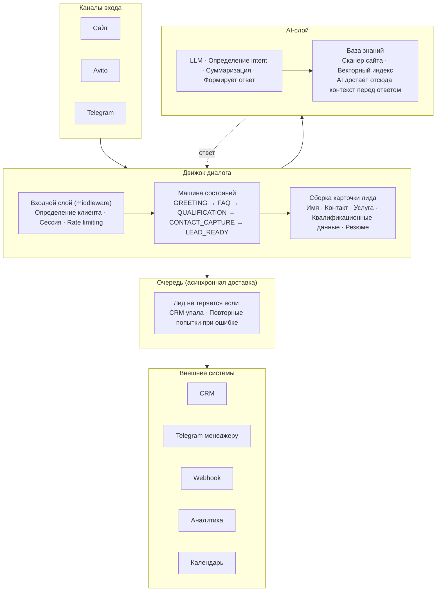
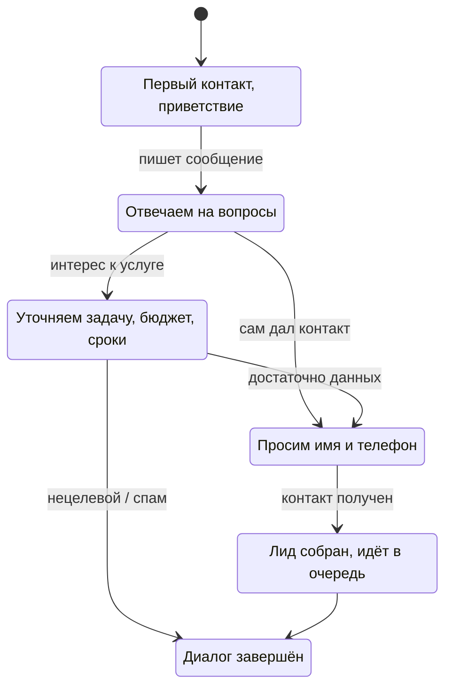
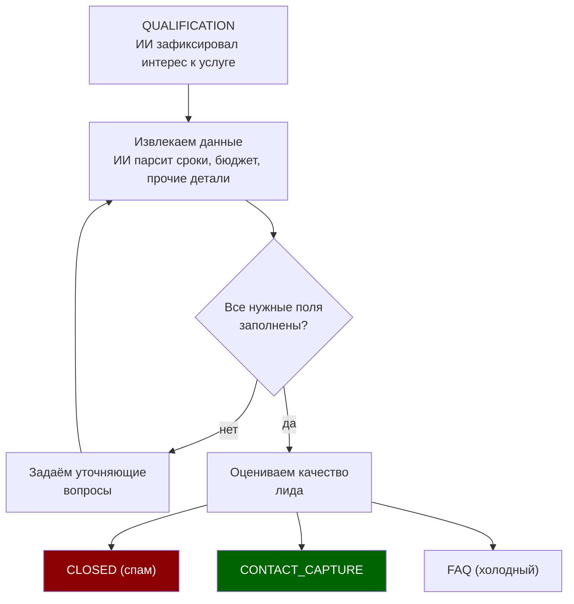
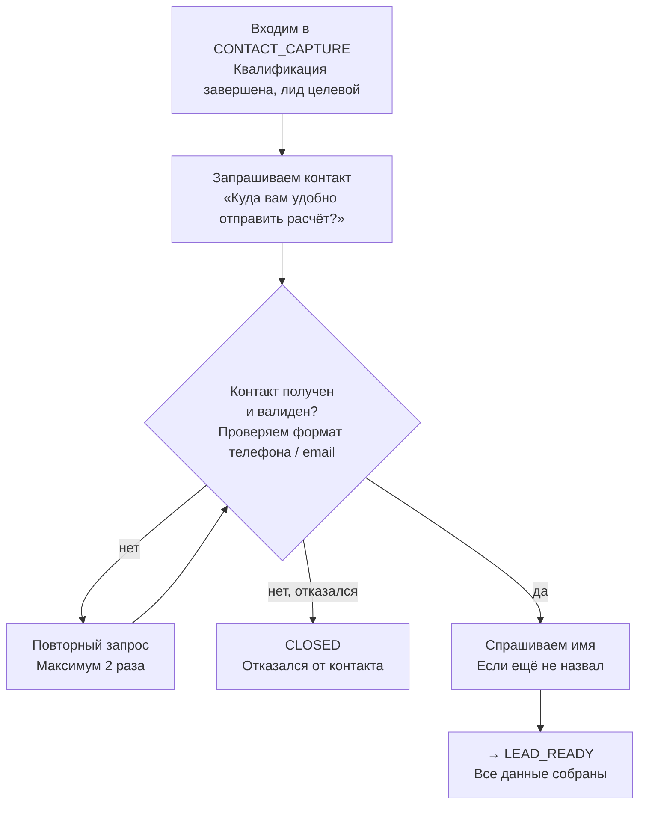
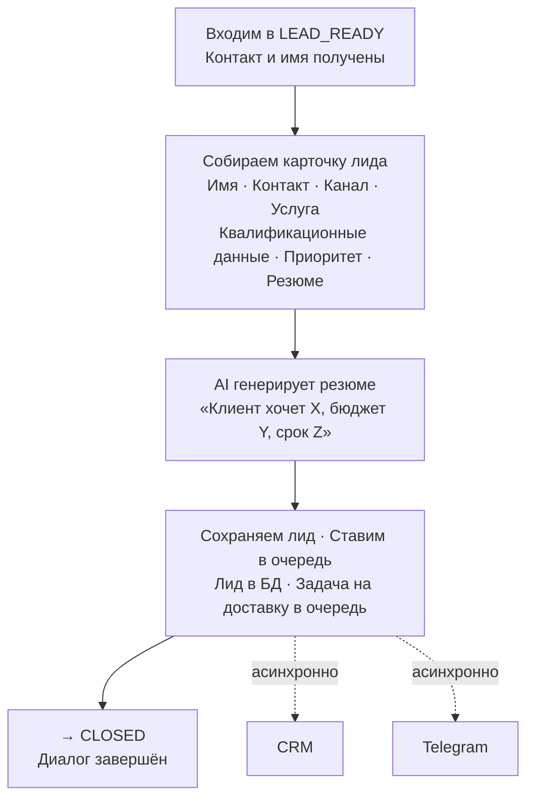
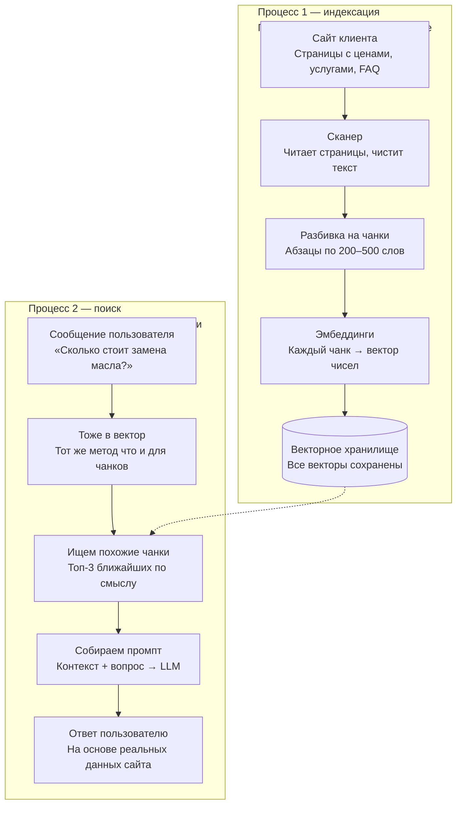
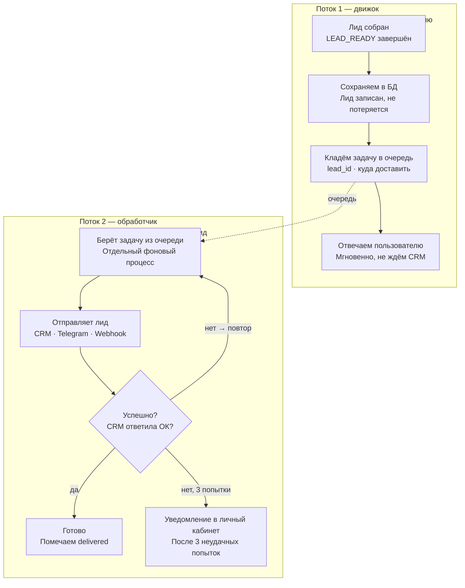
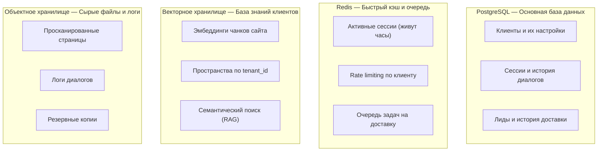
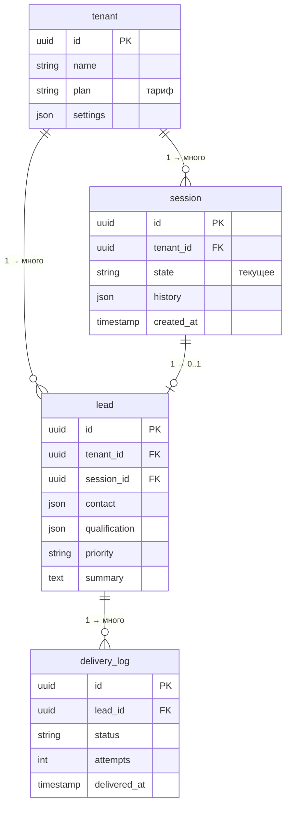

# System Design — Innova AI

## 1. Назначение системы

Innova AI — многопользовательская платформа автоматизации первого контакта с клиентом в цифровых каналах. Система принимает входящие сообщения, ведёт диалог, квалифицирует потребность, собирает контактные данные и передаёт структурированный лид в CRM, мессенджеры или внешние системы через webhook.

Ключевая цель — превращать анонимных посетителей в квалифицированные лиды для отдела продаж.

---

## 2. Границы системы

### Что входит

- Чат-виджет на сайте клиента
- Коннектор для Avito
- Движок диалога с машиной состояний
- AI-слой с поиском по базе знаний (RAG)
- Сборка и маршрутизация карточки лида
- Асинхронная доставка лидов во внешние системы
- Личный кабинет клиента с аналитикой
- Многопользовательская архитектура с тарифными планами

### Что не входит

- Контакт-центр с живыми операторами
- Замена CRM
- Собственная языковая модель
- Постпродажная автоматизация

---

## 3. Высокоуровневая архитектура



Система состоит из пяти слоёв. Сообщение пользователя проходит их сверху вниз:

1. **Каналы входа** — принимают сообщение от пользователя (сайт, Avito, Telegram)
2. **Движок диалога** — управляет сценарием от первого сообщения до готового лида
3. **AI-слой** — определяет intent, ищет контекст в базе знаний, формирует ответ
4. **Очередь** — асинхронно доставляет лид во внешние системы
5. **Внешние системы** — CRM, Telegram менеджеру, webhook, аналитика

Отправка лида в CRM и запись аналитики выполняются асинхронно — ответ пользователю не задерживается.

---

## 4. Движок диалога



Центральный компонент системы. При каждом входящем сообщении движок выполняет четыре шага:

1. Загружает контекст — текущее состояние диалога, историю, настройки клиента
2. Вызывает AI-слой — определяет intent, извлекает данные, получает черновик ответа
3. Обновляет состояние — сохраняет новые данные в сессию, принимает решение о переходе
4. Возвращает ответ пользователю немедленно

### 4.1 Машина состояний

Каждый диалог находится в одном из шести состояний:

| Состояние | Что происходит |
|---|---|
| `GREETING` | Первый контакт, приветствие |
| `FAQ` | Ответы на типовые вопросы по базе знаний |
| `QUALIFICATION` | Уточнение задачи, бюджета, сроков |
| `CONTACT_CAPTURE` | Сбор имени и контактных данных |
| `LEAD_READY` | Лид собран, помещается в очередь |
| `CLOSED` | Диалог завершён |

Основной путь:
`GREETING → FAQ → QUALIFICATION → CONTACT_CAPTURE → LEAD_READY → CLOSED`

Исключения:
- Пользователь передал контакт на этапе `FAQ` → переход сразу в `CONTACT_CAPTURE`, минуя `QUALIFICATION`
- Нецелевой запрос или спам на этапе `QUALIFICATION` → переход сразу в `CLOSED`

### 4.2 Состояние QUALIFICATION



Набор обязательных полей настраивается под каждого клиента в личном кабинете. Формулировку вопросов генерирует AI-слой — движок передаёт только название поля которое нужно получить.

Данные накапливаются в объекте сессии по мере разговора:

```python
session.qualification_data = {
    "service":  "замена масла",   # извлёк из первого сообщения
    "car":      "Toyota Camry",   # из второго
    "deadline": "эта неделя",     # из третьего
    "budget":   None              # ещё не собрано
}
```

Цикл продолжается пока все обязательные поля не заполнены.

По результатам квалификации система оценивает лид:
- **Целевой** → переход в `CONTACT_CAPTURE`
- **Холодный** → возврат в `FAQ`
- **Спам / нецелевой** → переход в `CLOSED`

### 4.3 Состояние CONTACT_CAPTURE



Система валидирует формат телефона или email. При невалидном вводе повторяет запрос. Максимум две попытки — после этого диалог переходит в `CLOSED`.

После получения контакта система запрашивает имя если оно не было названо ранее в диалоге.

### 4.4 Состояние LEAD_READY



Пользователь в этот момент уже получил ответ. Все действия выполняются асинхронно.

Порядок действий:
1. AI-слой генерирует резюме диалога в виде связного текста
2. Лид сохраняется в базу данных
3. Задача на доставку помещается в очередь
4. Диалог переходит в `CLOSED`

Лид сохраняется в БД до постановки задачи в очередь. Если очередь недоступна — лид не теряется.

### 4.5 Карточка лида

```python
{
    "name": "Иван Петров",
    "phone": "+7 999 123-45-67",
    "channel": "website",
    "source_url": "https://example.com/services",
    "service": "Замена масла",
    "qualification": {
        "car": "Toyota Camry",
        "deadline": "эта неделя",
        "budget": None
    },
    "priority": "warm",
    "summary": "Клиент хочет заменить масло на Toyota Camry в течение недели. Бюджет не уточнял.",
    "next_action": "Перезвонить и записать на удобное время"
}
```

---

## 5. AI-слой и RAG



AI-слой вызывается движком на шаге 2 обработки каждого сообщения. Выполняет четыре функции:

- **Intent** — определяет о чём спрашивает пользователь и есть ли интерес к услуге
- **Извлечение данных** — парсит из текста структурированные поля (услуга, сроки, бюджет)
- **Генерация ответа** — формирует ответ на основе контекста из базы знаний
- **Суммаризация** — создаёт резюме диалога для карточки лида

### 5.1 Построение индекса базы знаний

Выполняется один раз при настройке клиента:

1. Сканер обходит страницы сайта
2. Из страниц извлекается полезный текст, навигационный шум удаляется
3. Текст разбивается на фрагменты (chunks) по 200–500 слов
4. Каждый фрагмент преобразуется в векторное представление (embedding)
5. Векторы сохраняются в пространстве клиента в векторном хранилище

### 5.2 Поиск при каждом сообщении

1. Сообщение пользователя преобразуется в вектор
2. В хранилище ищутся топ-3 фрагмента ближайших по смыслу
3. Найденные фрагменты добавляются в промпт к LLM как контекст
4. LLM формирует ответ строго на основе переданного контекста

### 5.3 Структура промпта

```
Ты — помощник автосервиса "Иванов и Ко".
Отвечай только на основе информации ниже.
Если ответа нет — скажи что уточнишь у менеджера.

=== Информация с сайта ===
Замена масла: от 1500 руб., включает масляный фильтр.
Запись по телефону или через чат.
Работаем ежедневно с 9 до 21.

=== Вопрос клиента ===
Сколько стоит замена масла?
```

### 5.4 Защита от некорректных ответов

- LLM отвечает только на основе базы знаний
- При низкой уверенности система предлагает связаться с менеджером
- Запрещённые темы задаются в настройках клиента

---

## 6. Очередь лидов



Внешние системы вызываются не в момент ответа пользователю, а через очередь. Два независимых потока.

**Поток 1 — движок:**
1. Лид сохранён в БД
2. Задача на доставку помещается в очередь
3. Пользователь получает ответ немедленно

**Поток 2 — обработчик:**
1. Забирает задачу из очереди
2. Отправляет лид в CRM / Telegram / webhook
3. При успехе — помечает `delivered`
4. При ошибке — повторная попытка через нарастающий интервал
5. После 3 неудачных попыток — уведомление в личный кабинет клиента

---

## 7. Хранилища данных



| Хранилище | Технология | Назначение |
|---|---|---|
| Основная БД | PostgreSQL | Клиенты, сессии, лиды, история доставки |
| Кэш и очередь | Redis | Активные сессии, rate limiting, очередь задач |
| Векторное | Qdrant / pgvector | База знаний клиентов, семантический поиск |
| Объектное | S3-совместимое | Просканированные страницы, логи, резервные копии |

### 7.1 Схема таблиц PostgreSQL



**`tenant`** — бизнес-клиент платформы. Хранит тариф, настройки квалификации, тон бота, включённые интеграции.

**`session`** — один диалог с одним пользователем. Хранит текущее состояние машины и историю сообщений. Привязана к `tenant_id`.

**`lead`** — карточка лида. Поля `contact` и `qualification` хранятся как JSON — их структура различается у разных клиентов.

**`delivery_log`** — журнал попыток доставки лида.

```python
delivery_log:
    id            # уникальный номер записи
    lead_id       # FK → lead
    destination   # "bitrix24" / "telegram" / "webhook"
    status        # "pending" / "delivered" / "failed"
    attempts      # количество попыток
    last_error    # текст последней ошибки
    delivered_at  # timestamp успешной доставки (NULL если не доставлено)
    created_at    # timestamp создания задачи
```

---

## 8. Многопользовательская архитектура

Система обслуживает множество клиентов на одной платформе. Каждый клиент изолирован.

Что изолируется по `tenant_id`:
- Данные в PostgreSQL — все запросы фильтруются по `tenant_id`
- База знаний — отдельное пространство в векторном хранилище
- Настройки и интеграции — хранятся в таблице `tenant`
- История диалогов и лидов — недоступна другим клиентам

Тарифные ограничения задаются в `tenant.settings` и проверяются в middleware:
- Лимит диалогов в месяц
- Лимит страниц для сканирования
- Доступные каналы (сайт, Avito)
- Доступные интеграции (CRM, webhook)
- Расширенная аналитика — только на старших тарифах

---

## 9. Нефункциональные требования

### Производительность
- Первый ответ пользователю — не более 3–5 секунд
- Чат-виджет загружается асинхронно и не влияет на PageSpeed сайта клиента

### Надёжность

| Уровень | Uptime | Допустимый простой в год |
|---|---|---|
| Стандартный (SMB, Mid) | 99.5% | ~1.8 дня |
| Enterprise | 99.9% | ~8.7 часа |

- При недоступности LLM — резервный шаблонный ответ с предложением оставить контакт
- При недоступности CRM — лид сохранён в БД, очередь повторит попытку

### Безопасность
- Шифрование трафика — HTTPS/TLS
- Шифрование данных в хранилищах
- Изоляция данных между клиентами через `tenant_id`
- Персональные данные не пишутся в логи в открытом виде
- Соответствие 152-ФЗ — данные хранятся на серверах в России

### Масштабируемость
- Горизонтальное масштабирование движка диалога и AI-слоя
- Рост числа клиентов, диалогов и страниц базы знаний без переработки архитектуры

---

## 10. Этапность реализации

### Этап 1 — Ядро
Цель: один клиент получает первый лид через систему.

- Чат-виджет на сайте
- Полная машина состояний (все 6 состояний)
- База знаний на основе сканера сайта + RAG
- Доставка лида в одну CRM и Telegram
- Базовый личный кабинет — список лидов и статусы доставки

### Этап 2 — Платформа
Цель: несколько клиентов на одной платформе с разными тарифами.

- Полный multi-tenancy — изоляция данных, настройки по клиенту
- Тарифные планы и лимиты
- Расширенный личный кабинет — аналитика, история диалогов
- Гибкая маршрутизация лидов по правилам

### Этап 3 — Каналы
Цель: полный охват каналов спроса из PRD.

- Коннектор Avito
- Бронирование через Google Calendar / YClients
- Несколько LLM-провайдеров с fallback
- Расширенная аналитика — конверсии, воронка, качество лидов
